# .NET期末项目文档

# **一、** 项目功能简介

## 1.1账户与管理员模块

### 1.1.1登录注册

用户可以在首页进行注册/登录。在登录/注册页面用户提交表单后经由前端将数据传输到后端，后端根据传来的数据查询数据库，对数据进行验证，并将结果传回给前端。验证成功后则根据用户所属的权限分别跳转到学生/管理员界面。在跳转后的页面上可进行退出操作。 

### 1.1.2账户管理

管理员可以在账户管理界面对所有用户账户进行管理，包括新增/注销账户功能，修改用户的一些基本信息功能。管理员先选择需要管理的账户，然后选择要对其进行的操作，确认操作后，前端将信息发送给后端。服务器分析请求，如果操作有效则将数据写入数据库并返回操作成功的信息，如果无效则返回失败的信息。 

## 1.2在线评审模块（OJ模块）

### 1.2.1.结果反馈

用户通过提交写在代码区的代码，经由前端传输数据到后端，后端将数据解析，提取代码部分，运行该代码，再将结果反馈给前端，前端将信息渲染后显示给用户。 

### 1.2.2.查看题解

用户在某一道题目中选择查看题解，需求经由前端传输到后端，后端解析需求，去数据库查询相应的题解数据，如果数据库存在该题解，则返回题解给前端，如果不存在该题解，则返回失败信息给前端，前端将信息渲染后展示给用户。 

### 1.2.3管理员增加/删除/编辑题目  

管理员可以在管理员界面上对所有题目进行增删改查，相应的操作请求由前端传给后端，后端对应的操作数据库，将结果返回到前端。 

### 1.2.4用例管理

管理员可以在用例管理界面对所有用例进行管理，包括新增用例、删除用例、决定用例是否对用户可见等功能

### 1.2.5用户提交测试 

用户在某一道题中根据自己的喜好选择作答语言，并根据题目要求在在线编辑器中进行作答。用户回答完成后点击提交，用户代码会自动保存并发送服务器进行编译，同时会根据题库中的用例对用户作答的正确性进行判断。若用户作答正确则向用户返回通过答案的运行时长和内存占用情况。若不通过，则向用户返回编译错误信息或错误用例信息。 

### 1.2.6用户保存代码 

用户在修改完代码后，可以选择保存代码，也可以在退出页面时得到是否保存代码的提示。如果用户选择保存代码，则前端会把代码发送到后端，后端再进行数据库的存取。如果成功则返回成功信息，如果失败则返回失败信息。 

### 1.2.7用户查询题库 

用户进入题库，可以通过输入题目序号或题目关键字查询题目信息。系统按照题目所考察的算法知识模块和困难程度等信息对题目进行分类，方便用户对众多题目进行筛选和查询。 

## 1.3在线工具模块  

### 1.3.1在线编译 

用户将代码提交，经由前端传输数据到后端，后端提取代码部分，编译并运行代码，再将结果反馈给前端，前端将信息渲染后显示给用户。 

### 1.3.1.1Java语言支持 

实现用户在线编译Java语言，将用户在云端编辑器的中输入的或是直接上传的代码进行编译，并向用户返回编译结果，并在编译失败时提供有效的报错信息。 

### 1.3.1.2C/C++语言支持 

实现用户在线编译C或C++语言，将用户在云端编辑器的中输入的或是直接上传的代码进行编译，并向用户返回编译结果，并在编译失败时提供有效的报错信息。 

### 1.3.1.3Python语言支持 

实现用户在线编译Python语言，将用户在云端编辑器的中输入的或是直接上传的代码进行编译，并向用户返回编译结果，并在编译失败时提供有效的报错信息。 

### 1.3.2学习资料查询与下载 

用户提交资料的搜索信息，经由前端传输到后端，后端解析该查询信息，并去数据库查询相应的资料数据，如果数据库存在相关资料，则返回资料的url给前端，如果不存在，则返回失败信息给前端，前端将信息渲染后展示给用户。 

### 1.3.3云端编辑器 

功能：支持代码编辑，代码会运行、保存在云端。支持Cpp、C、Java、Python等语言。 

编辑：支持复制、黏贴、注释等。 

一键编译运行：向用户反馈运行的结果、时间与内存占用情况。 

### 1.3.4在线计算器 

实现加减乘除等多种计算，用户可以在网页上使用基本的计算器功能。用户点击“=”号之后会返回计算结果。

## 1.4题解评论模块 

###  1.4.1上传评论 

用户选择一个题解，将自己的评论写入到文本框中并将其上传，服务器对其内容经过逻辑检验后将评论写入到数据库中，以供其他用户查看。 

###  1.4.2删除评论 

用户在自己的用户界面中可以选择一条自己曾上传过的评论，选择将其删除，服务器在接收到请求之后，从数据库中将其删除，其他用户界面中不再显示该条评论。 

###  1.4.3点赞评论 

用户在题解界面下，查看其他用户评论的同时，可以对该条评论进行点赞表示赞许，服务器会将评论的点赞数写入到数据库中。 

###  1.4.4上传题解

用户点击上传题解，将自己的评论写入到文本框中并将其上传，服务器对其内容经过逻辑检验后将评论写入到数据库中，以供其他用户查看。 

###  1.4.5点赞题解 

用户点击点赞五角星按钮，服务器会将评论的点赞数写入到数据库中。 

# **二、** 项目界面设计与用户说明书

## 2.1账户模块 

### 2.1.1登录注册 

​	进入网站后显示登录/注册页面，用户若已有账号则可输入账号密码以直接进入网站主页。而若用户尚未有账号，则需要进行注册。在这里输入用户名、密码、邮箱等信息，验证邮箱后即可完成账号注册。 

### 2.1.2账户管理 （Blazor）

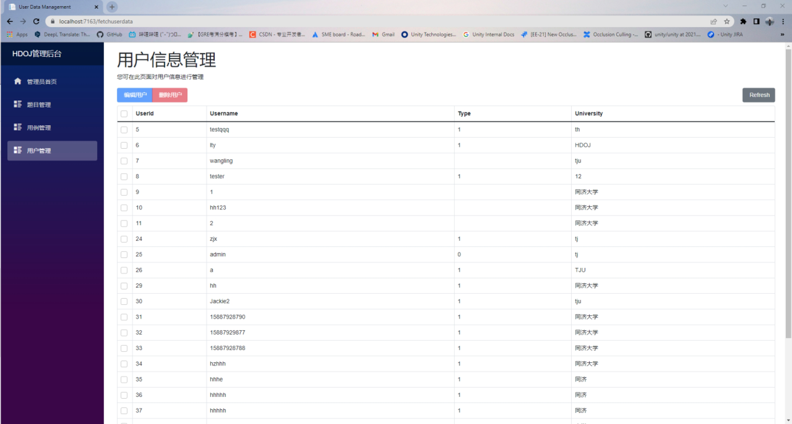 

管理员可以进入管理页面对所有账户进行管理，每个账户的基础信息会显示在一个表单之中，并且可以选择对其进行修改或删除，均会显示出相应的表单或提示框以供管理员操作。 

## 2.2在线评审模块（OJ模块）

### 2.2.1结果反馈 

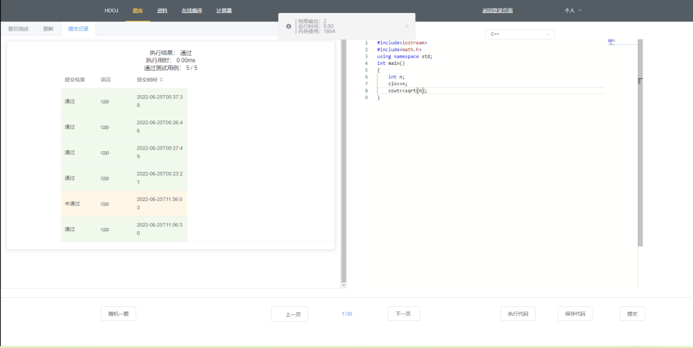 

用户答题完成后，点击提交按钮，系统自动保存代码、自动编译并将结果和用例库中的正确答案进行比对。若用户答题正确，则返回占用内存和时间信息，并通知用户已通过。若答题不正确，则向用户返回未通过的用例展示，并告知用户未通过。若代码编译不通过，则告知用户未通过，并同时将编译错误信息返回给用户。 

### 2.2.2查看题解

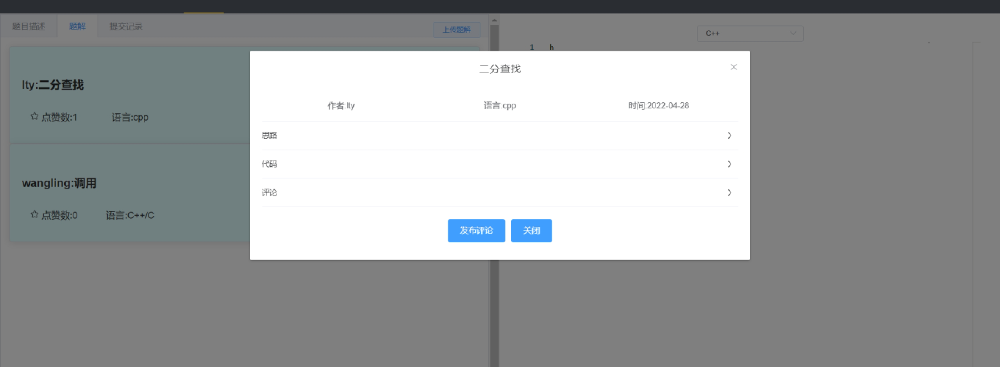

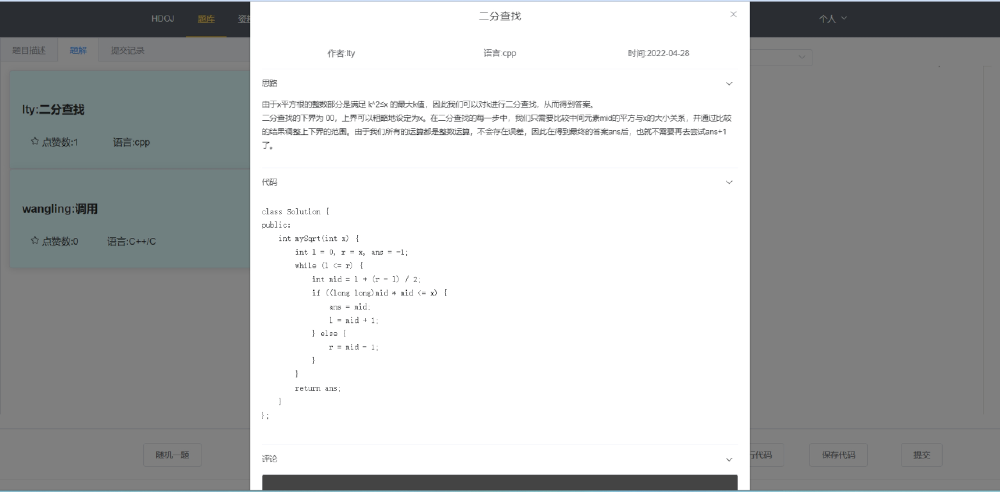用户在答题页面任何时候都可以点击题解，调出题解菜单。用户选择自己想要查看的题解后，点击相应题解进入到详细题解页面。题解共分为3个部分：思路、代码、评论。在思路部分，用户可以看到该题解对于该题的详细解决思路。在代码部分，用户可以看到相应的可运行代码。在评论部分可以看到其它用户对于该题解的评论。最后，用户也可以点击下方的发布评论来发表自己对于该题解的看法。 

### 2.2.3管理员增加/删除/编辑题目

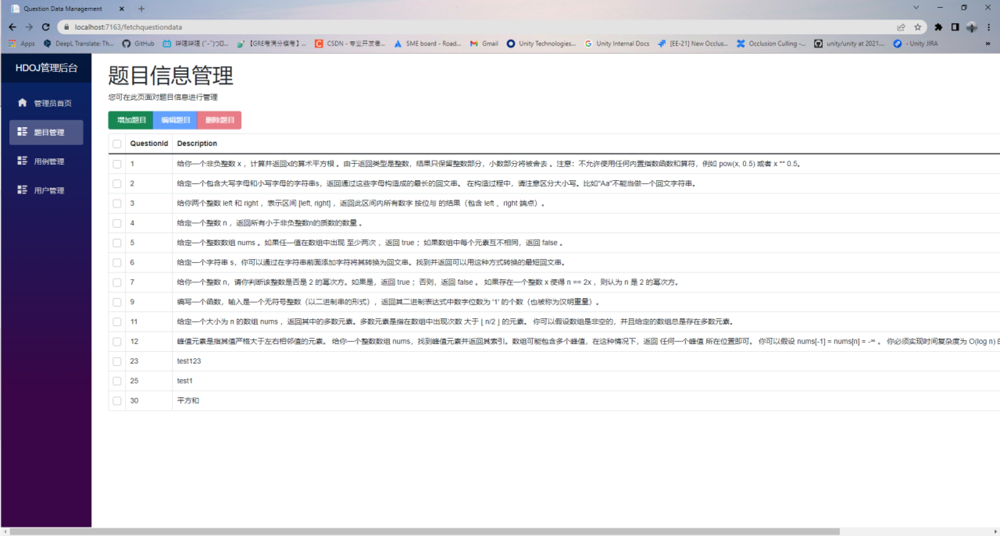 

管理员在登录认证成功后，进入管理页面，可以选择对题库进行修改。其中包括增加、删除题目。其中增加题目需要点击上方上传新题目进行上传，需要填入题目相关的信息。 

### 2.2.4用户提交测试

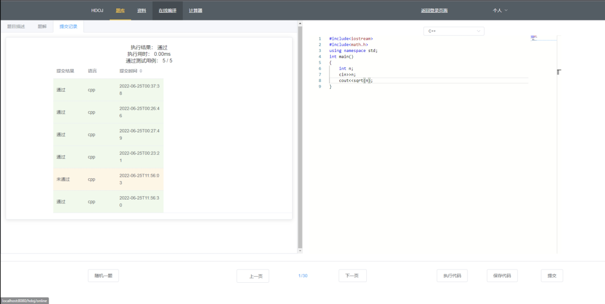 

​	用户根据题目要求进行编码，并能够根据自己的喜好在下拉菜单中选择自己想要使用的语言进行作答。为了能使系统正确对答案作出判断，用户需要完整完成程序作答，并输出答案。 

用户答题完成后，点击提交按钮，系统会自动保存代码，并提交系统进行编译和判断答案。 

### 2.2.5用例管理（Blazor）

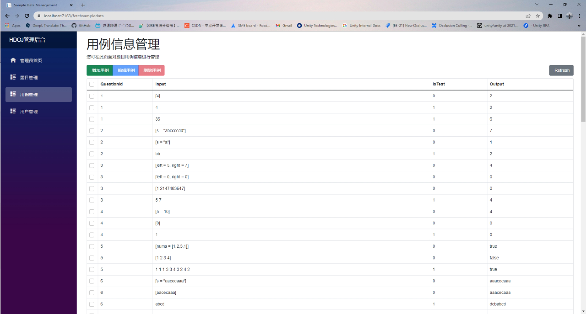 

管理员可以进入管理界面对所有用例进行管理。管理员可以直接添加新的用例，也可以选中其中一条进行编辑修改，亦可以批量进行删除操作。

### 2.2.6用户保存代码

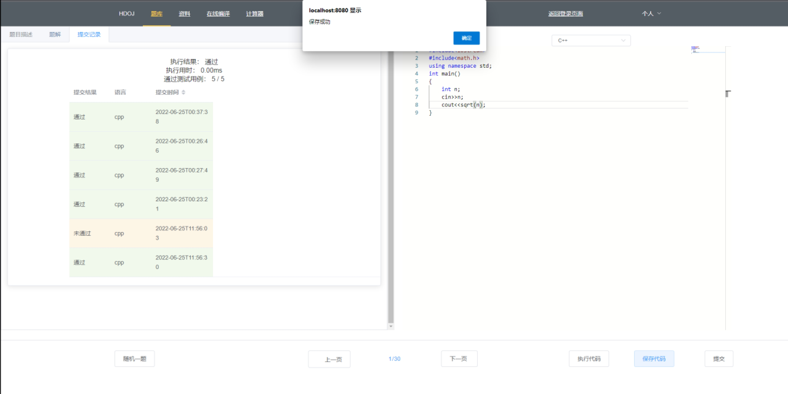 

用户在答题页面可随时通过保存代码按钮将自己的代码连同语言信息一同保存至系统数据库中。用户下次登录回到这道题时，系统会自动加载用户上次未完成的代码，方便用户继续作答。 

### 2.2.7用户查询题库

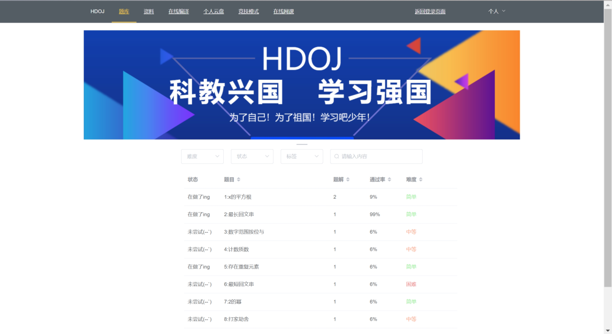

用户查询提题库。

## 2.3在线工具模块 

### 2.3.1在线编译  

#### 2.3.1.1Java语言支持 

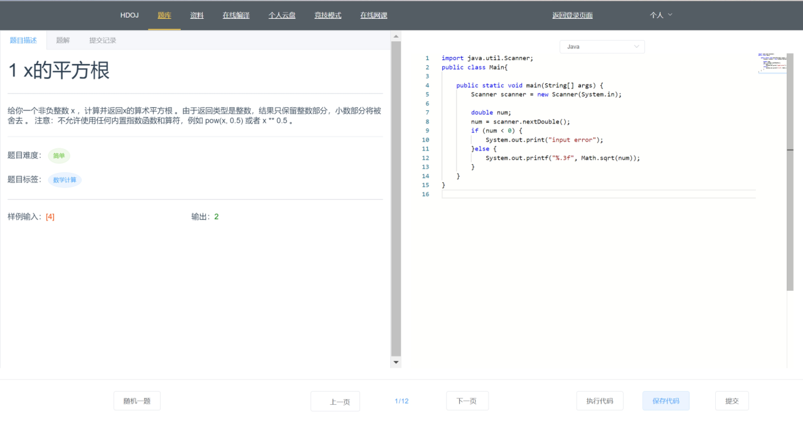

用户可选择Java作为作答语言，并在在线编译时获得Java对应的高亮提示。 

#### 2.3.1.2C/C++语言支持 

用户可选择C作为作答语言，并在在线编译时获得C对应的高亮提示。 

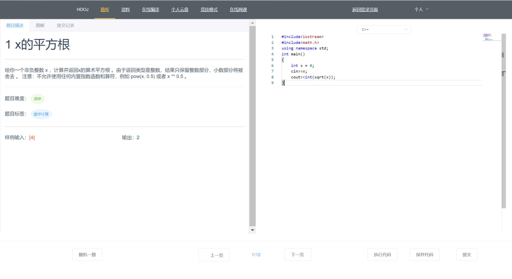

用户可选择C++作为作答语言，并在在线编译时获得C++对应的高亮提示。 

#### 2.3.1.3Python语言支持 

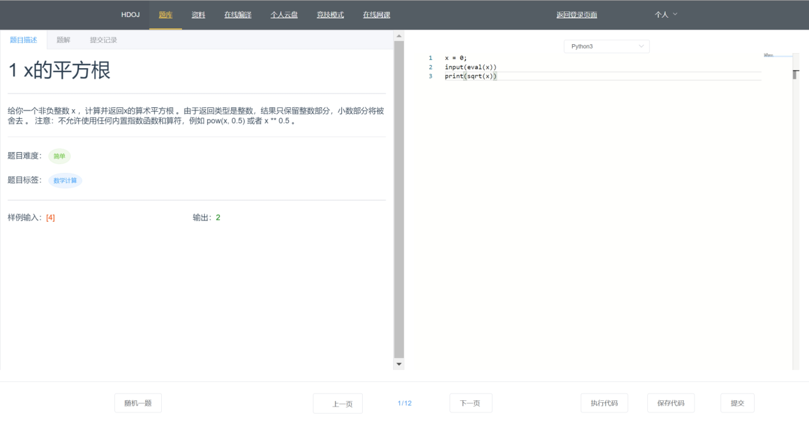

用户可选择Python作为作答语言，并在在线编译时获得Python对应的高亮提示。 

### 2.3.2学习资查询与下载 

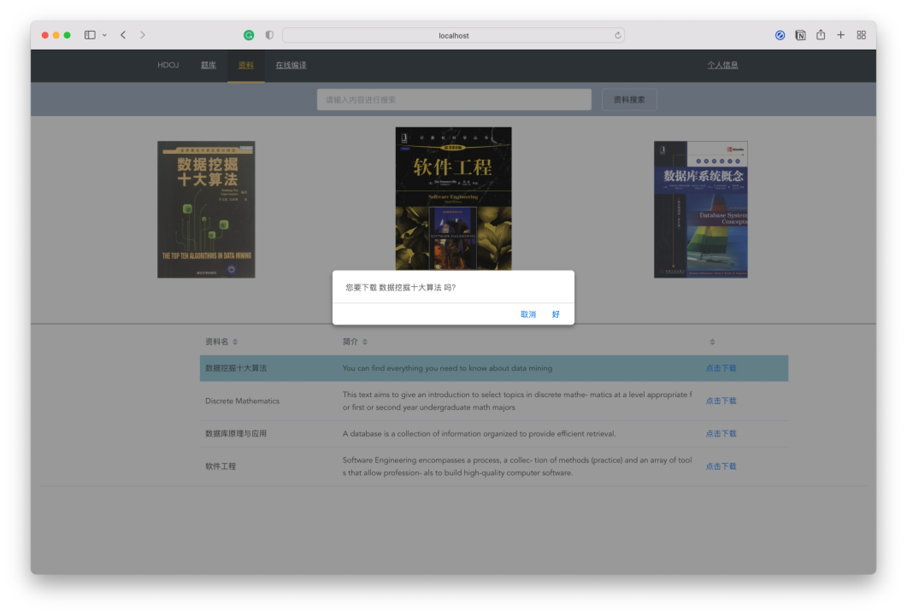

学习资料下载

### 2.3.3云端编辑器

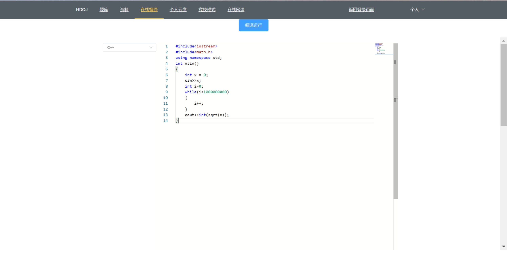

用户可以通过云端编译器快捷方便地对C，C++，Java，Python，PHP等主流编程语言进行在线编译。用户只需选择对应语言，即可在在线编辑时获得相应的高亮提示。 

用户在完成代码输入后点击编译运行，系统就会自动进行编译。若编译通过，将运行结果、运行时间和占用内存返回给用户。若运行不通过，则将编译错误提示返回给用户。

### 2.3.4在线计算器

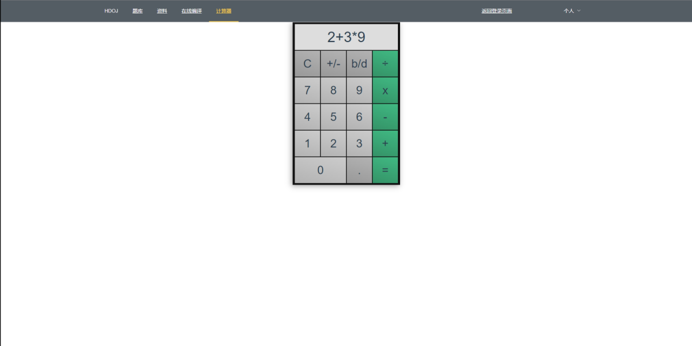 

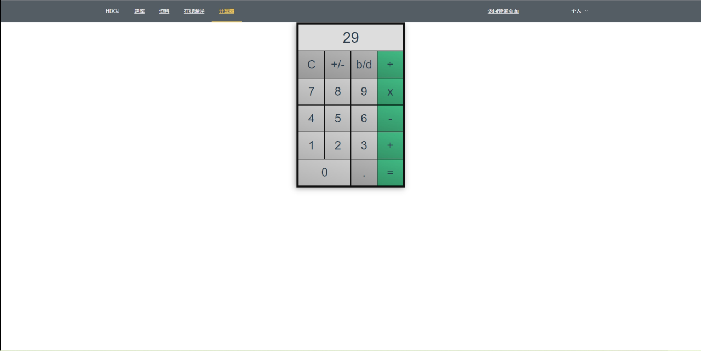 

通过逆波兰表达式来实现加减乘除等多种计算，用户可以在网页上使用基本的计算器功能。用户点击“=”号之后会返回计算结果。

## 2.4题解评论模块 

###  2.4.1上传评论 

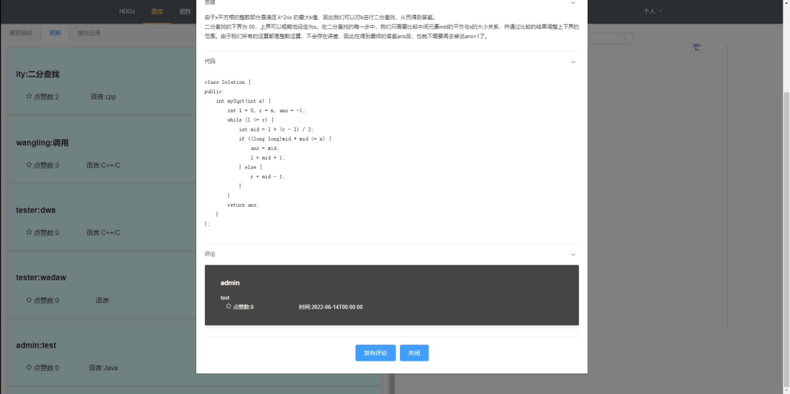 

用户选择一个题解，将自己的评论写入到文本框中并将其上传，服务器对其内容经过逻辑检验后将评论写入到数据库中，以供其他用户查看。 

###  2.4.2删除评论 

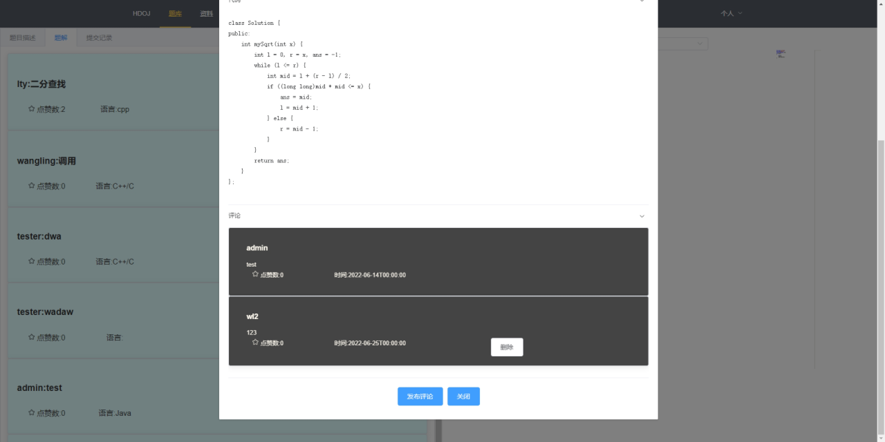 

用户在自己的用户界面中可以选择一条自己曾上传过的评论，选择将其删除，服务器在接收到请求之后，从数据库中将其删除，其他用户界面中不再显示该条评论。 

###  2.4.3点赞评论 

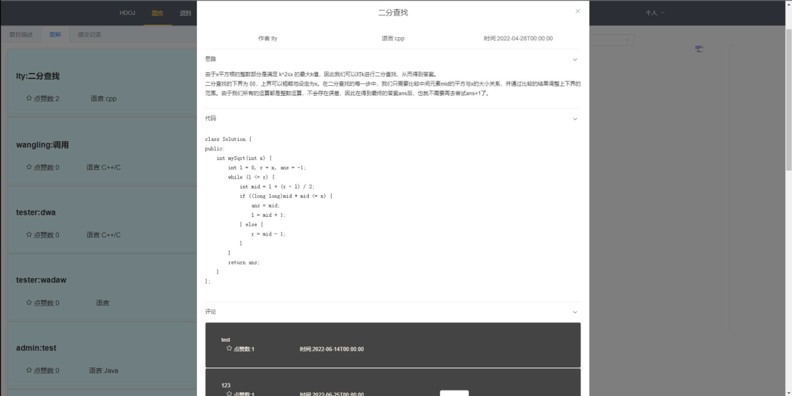 

用户在题解界面下，查看其他用户评论的同时，可以对该条评论进行点赞表示赞许，服务器会将评论的点赞数写入到数据库中。 

###  2.4.4上传题解

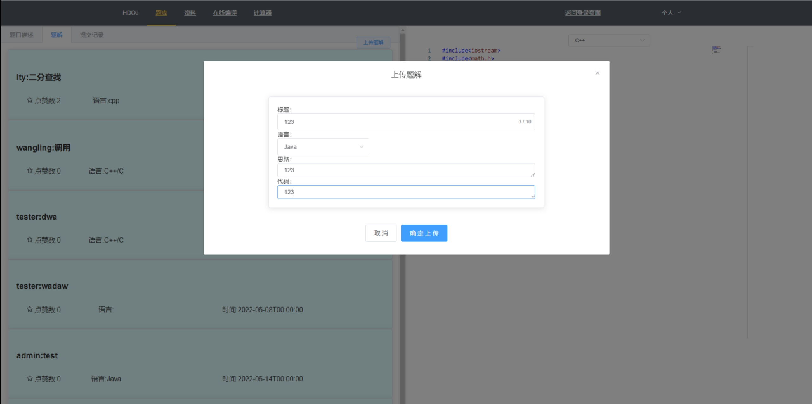 

用户点击上传题解，将自己的评论写入到文本框中并将其上传，服务器对其内容经过逻辑检验后将评论写入到数据库中，以供其他用户查看。 

###  2.4.5点赞题解 

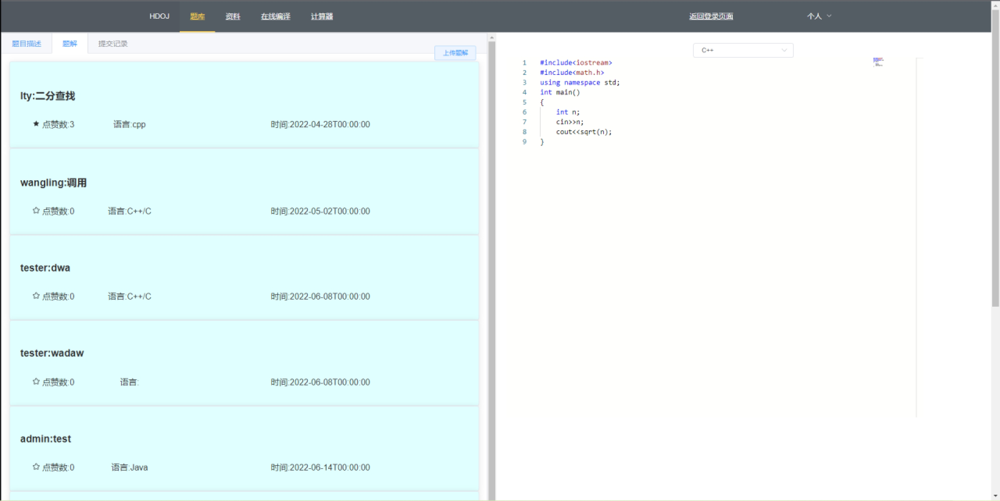 

用户点击点赞五角星按钮，服务器会将评论的点赞数写入到数据库中。 

# **三、** 项目结构设计

## 3.1项目所采用的技术栈

在实现本项目的过程中，为了充分联系我们在.NET课程中所学习到的技术，我们使用ASP.NET Web Api作为整个网页App的后端开发核心，同时使用了Blazor与Vue作为前端框架。其中，充分利用Blazor快捷、轻量化的特点，进行管理员界面的开发，而对于更为复杂的用户界面则使用Vue进行开发。同时，在后端开发的过程中，为了进一步提升程序的运行效率，我们利用c++实现编译好了部分模块的dll供.NET运行时调用，并结合了C++/CLI利用C#直接调用C++实现了在线计算器服务。

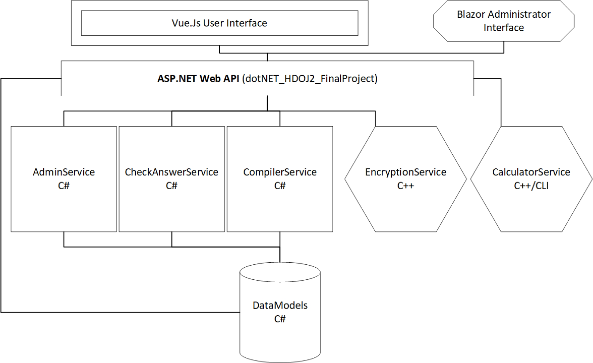 

## 3.2项目程序集划分

### 3.2.1 dotNET_HDOJ2_FinalProject

项目的主程序，包含了项目的前后端交互的全部接口（Controller）以及利用Blazor所实现的管理员界面的前端页面。

### 3.2.2 AdminService

C#程序集（管理员相关服务），为使用Blazor实现的管理员前端界面提供后端的数据库交互接口及业务逻辑服务。

### 3.2.3 CompilerService

C#程序集（编译运行相关服务），为项目中的在线编译与多语言程序在线运行功能提供服务。程序集中封装了与第三方编译服务提供网站的接口API与相关数据处理逻辑。

### 3.2.4 DataModels

C#程序集（数据库相关服务），利用EntityFramework的MySql插件，将MySql项目数据库中的实体类映射到项目中，为项目提供数据支持服务。

### 3.2.5 CheckAnswerService

C#程序集（用户答题正确性判断服务），为项目中的题目提供答题判断服务。程序集中封装了与第三方编译服务提供网站的接口API与相关题目数据处理逻辑。用户点击提交按钮之后会反馈答题的正确与否以及错误的样例、运行时间等信息。

### 3.2.6 AES

C++程序集（加密相关服务），用户的密码在存入数据库前，需要进行加密处理，以避免明文存储造成安全隐患。实现了包括md5加密以及aes加密和解密。

### 3.2.7 CalculatorService

C++程序集（计算器相关服务），使用符号等级排名来处理符号优先级，使用后缀表达式（逆波兰表达式）来处理运算表达式，使用符号栈和数字桟来进行存储与计算。

# **四、** 项目各模块实现

## 4.1主程序集

### 4.1.1 主程序集中的Controller接口封装

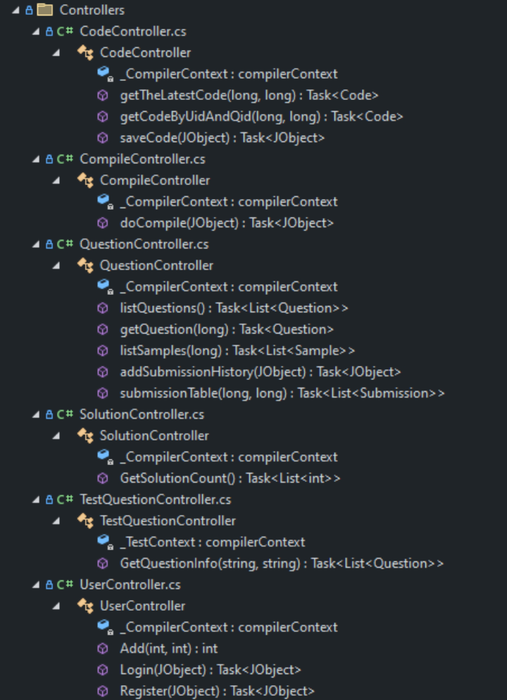 

| 类                 | 说明                                 |
| ------------------ | ------------------------------------ |
| CodeController     | 提供与保存代码相关的服务接口         |
| CompilerController | 提供与编译服务相关的接口             |
| QuestionController | 提供了与题目提交、题目显示相关的接口 |
| SolutionController | 提供了与题解查看与题解上传相关的接口 |
| UserController     | 提供了与用户登录注册相关的接口       |

### 4.1.2主程序集中的Blazor页面实现

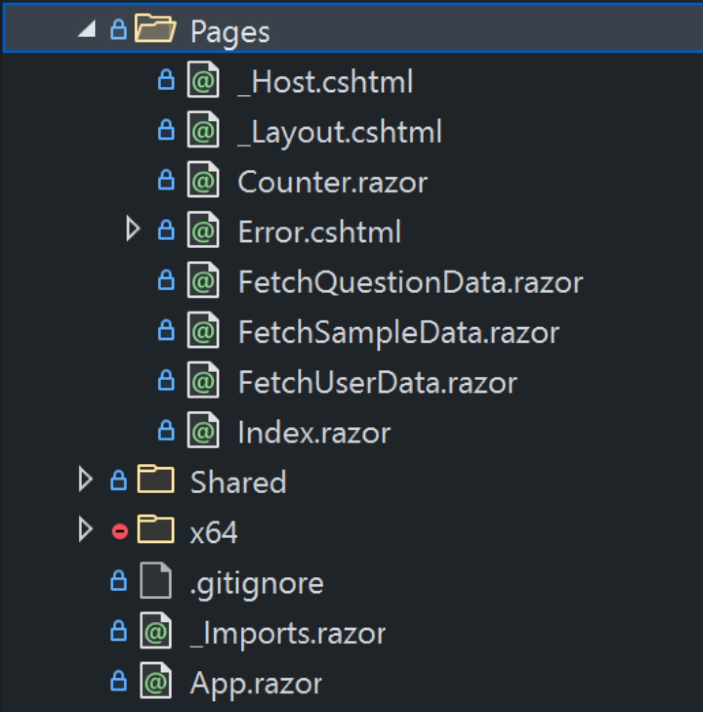 

| Razor组件         | 说明                                                   |
| ----------------- | ------------------------------------------------------ |
| FetchQuestionData | 用于展示管理员对题目内容的增删改查的界面               |
| FetchSampleData   | 用于展示管理员对展示样例与测试用例的增删改查的界面     |
| FetchUserData     | 用于展示管理员对用户信息的修改与对违规用户的删除的界面 |

## 4.2管理员程序集（AdminService）

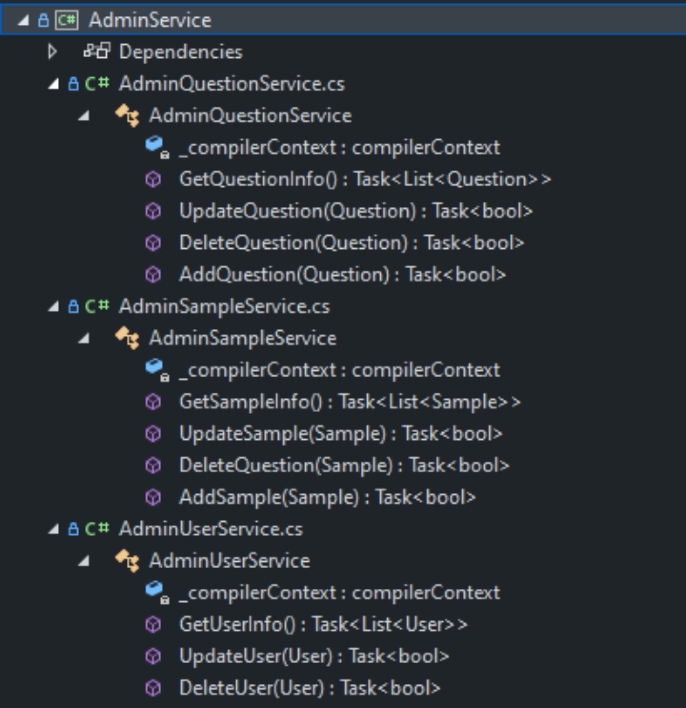 

| 模块         | 类                   | 方法            | 说明                     |
| ------------ | -------------------- | --------------- | ------------------------ |
| AdminService | AdminQuestionService | GetQuestionInfo | 从数据库获取全部问题列表 |
|              |                      | UpdateQuestion  | 保存更新后的问题         |
|              |                      | DeleteQuestion  | 删除一个问题             |
|              |                      | AddQuestion     | 增加一个问题             |
|              | AdminSampleService   | GetSampleInfo   | 从数据库获取全部用例列表 |
|              |                      | UpdateSample    | 保存更新后的用例         |
|              |                      | DeleteSample    | 删除一个用例             |
|              |                      | AddSample       | 增加一个用例             |
|              | AdminUserService     | GeUserInfo      | 从数据库获取全部用户列表 |
|              |                      | UpdateUser      | 保存更新后的用户         |
|              |                      | DeleteUser      | 删除一个用户             |

## 4.3 在线编译程序集（CompilerService）

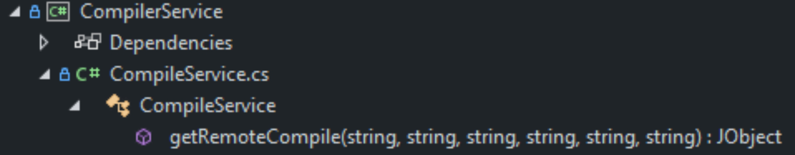 

| 模块            | 类              | 方法             | 说明                                                |
| --------------- | --------------- | ---------------- | --------------------------------------------------- |
| CompilerService | CompilerService | getRemoteCompile | 与第三方编译服务提供网站的API进行交互并进行数据处理 |

## 4.4 数据支持程序集（DataModels）

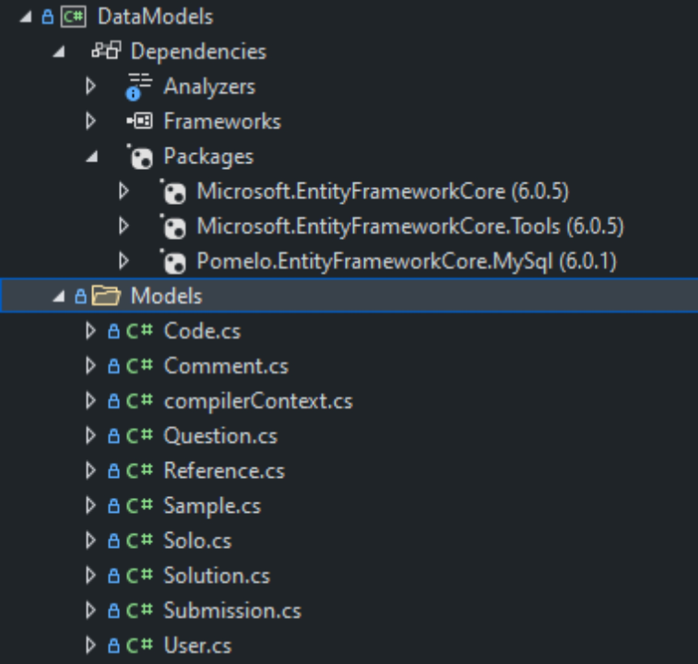 

| 模块       | 类              | 方法 | 说明             |
| ---------- | --------------- | ---- | ---------------- |
| DataModels | Code            | N/A  | 代码保存实体类   |
|            | Comment         | N/A  | 用户评论实体类   |
|            | compilerContext | N/A  | 数据库基本服务类 |
|            | Question        | N/A  | 题目实体类       |
|            | Reference       | N/A  | 参考材料实体类   |
|            | Sample          | N/A  | 题目用例实体类   |
|            | Solution        | N/A  | 题解实体类       |
|            | Submission      | N/A  | 提交记录实体类   |
|            | User            | N/A  | 用户实体类       |

## 4.5 答题检查程序集（CheckAnswerService）

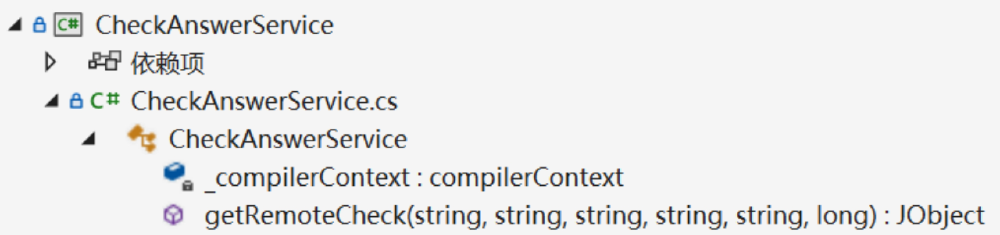 

| 模块               | 类                 | 方法           | 说明                                                         |
| ------------------ | ------------------ | -------------- | ------------------------------------------------------------ |
| CheckAnswerService | CheckAnswerService | getRemoteCheck | 为项目中的题目提供答题判断服务。反馈答题的正确与否以及错误的样例、运行时间等信息。 |

## 4.6加密服务程序集（AES）

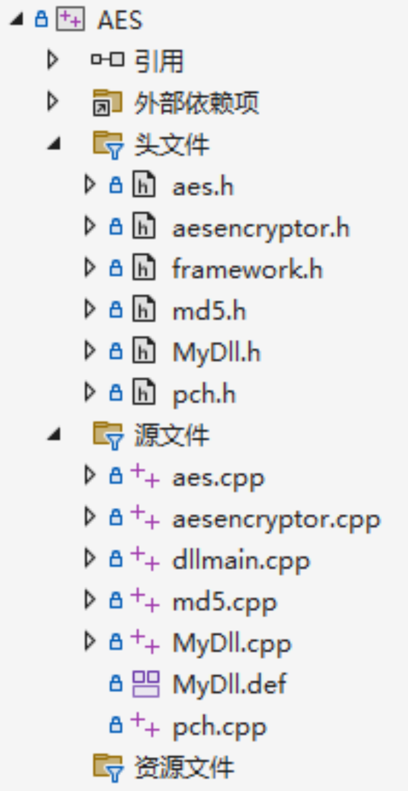 

| 模块 | **头文件**       | 说明                           |
| ---- | ---------------- | ------------------------------ |
| AES  | aes.h            | AES编码类                      |
|      | aesencryptor.h   | AES加密解密类                  |
|      | framework.h      | 框架，包括windows头文件        |
|      | md5.h            | MD5编码类                      |
|      | MyDll.h          | MATH库API引用                  |
|      | pch.h            | 预编译标头文件                 |
|      | **源文件**       |                                |
|      | aes.cpp          | AES编码类函数实现              |
|      | aesencryptor.cpp | AES加密解密类函数实现          |
|      | dllmain.cpp      | 定义DLL程序的入口函数DllMain() |
|      | md5.cpp          | MD5编码类实现                  |
|      | MyDll.cpp        | MATH库API实现                  |
|      | pch.cpp          | 与预编译标头对应的源文件       |

## 4.7计算器程序集 （CalculatorService）

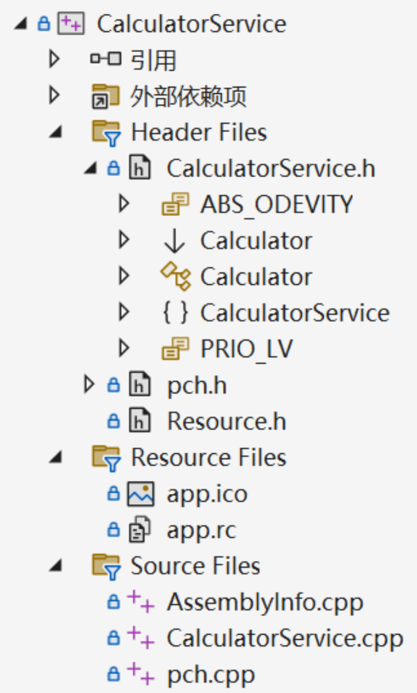 

| 模块              | **头文件**            | 说明                     |
| ----------------- | --------------------- | ------------------------ |
| CalculatorService | CalculatorService.h   | 计算器类和部分函数的实现 |
|                   | Resource.h            | 自动生成的资源头文件     |
|                   | pch.h                 | 预编译标头文件           |
|                   | **源文件**            |                          |
|                   | CalculatorService.cpp | 与计算器类对应的源文件   |
|                   | AssemblyInfo.cpp      | 自动生成的安装信息源文件 |
|                   | pch.cpp               | 与预编译标头对应的源文件 |

 

# **五、** 项目部署简介

本项目采用前后端分离开发，所以在部署是，项目前端和项目后端也采用分离部署。

## 5.1项目后端

本项目的后端接口采用ASP.NET Web API框架，部署在本地，在使用Visual Studio将项目发布后，在本地安装dot net Server的运行时，并使用IIS对项目后端进行部署，将本地localhost的7163端口开放给后端服务。

 

 

## 5.2项目前端

本项目的用户前端交互界面使用了Vue框架，通过node js打包后利用Windows IIS在本地进行了部署将本地的8080端口开放给前端。同时，为了使用便利，还在部署时为项目增设了本地域名www.huangduoj.com；而管理员前端交互界面则使用了Blazor进行搭建，同样利用Windows IIS部署在本地。

 

 

## 5.3项目数据库

本项目使用了MySQL数据库，部署在阿里云服务器上，数据库关系图如下：

 

# **六、** 项目分工

| **1950067娄天宇 50%** | **1951504王凌 50%** |
| --------------------- | ------------------- |
| C++/CLR程序集实现     | C++/CLR程序集实现   |
| C++ DLL实现           | C++ DLL实现         |
| C# ASP.NET部分实现    | C# ASP.NET部分实现  |
| C# Blazor部分实现     | C# Blazor部分实现   |
| Vue js 前端实现       | Vue js 前端实现     |

 